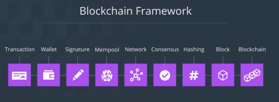
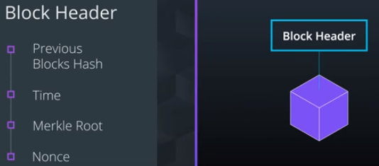
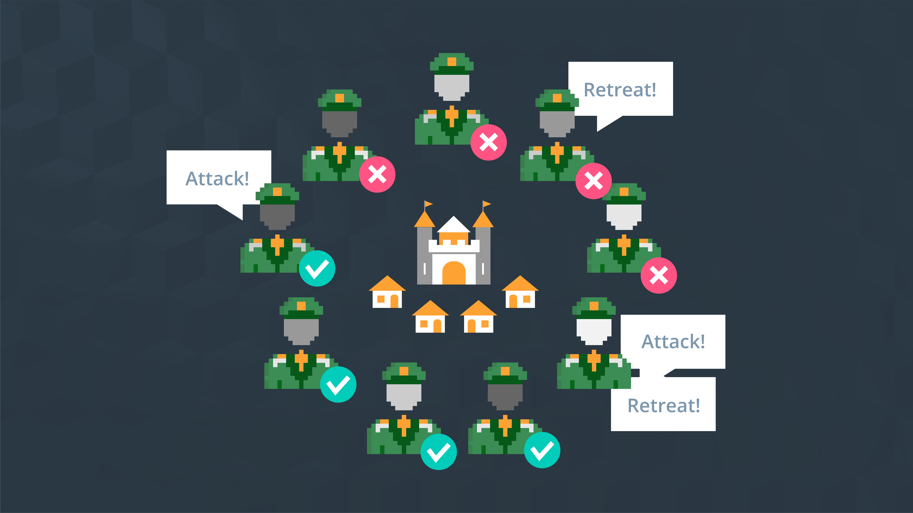
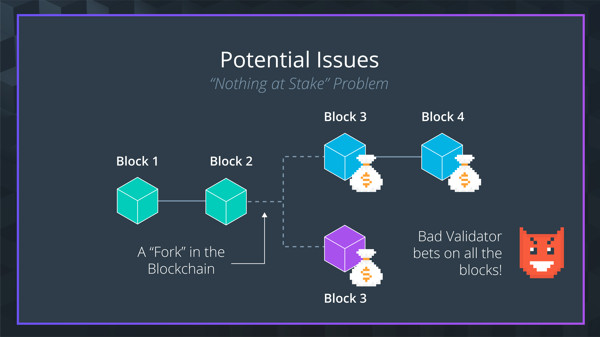
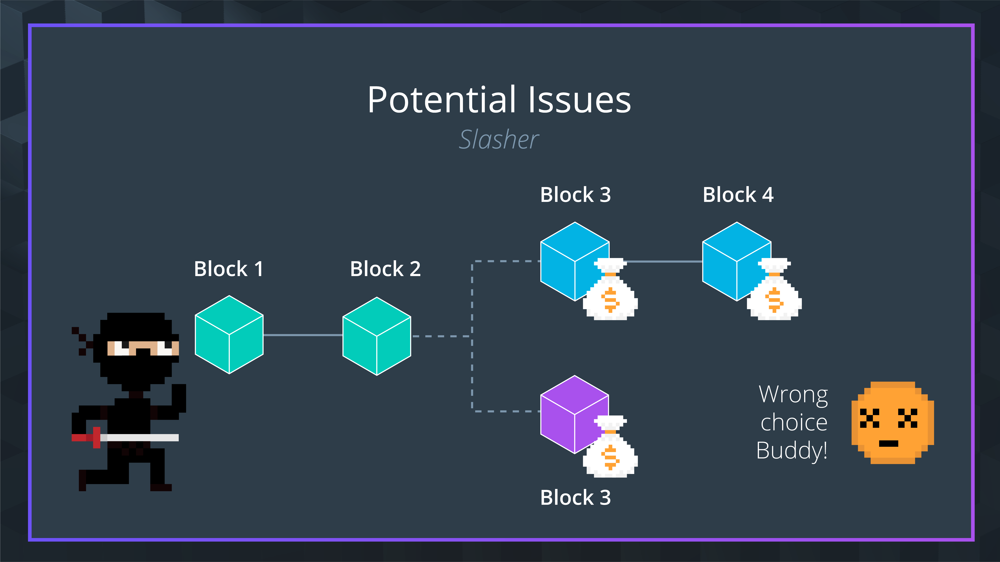
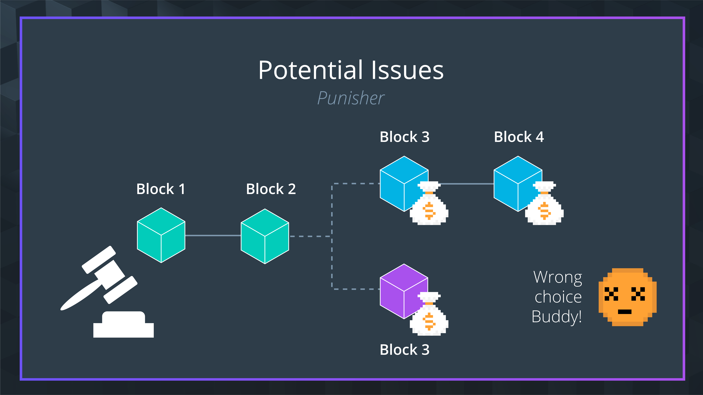
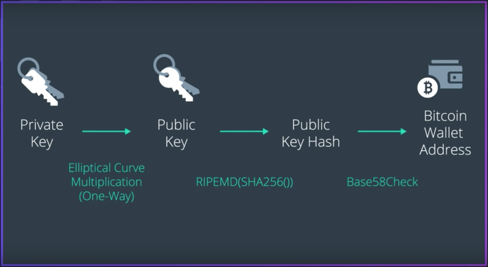
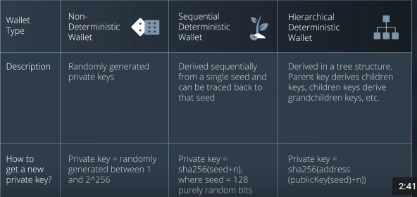
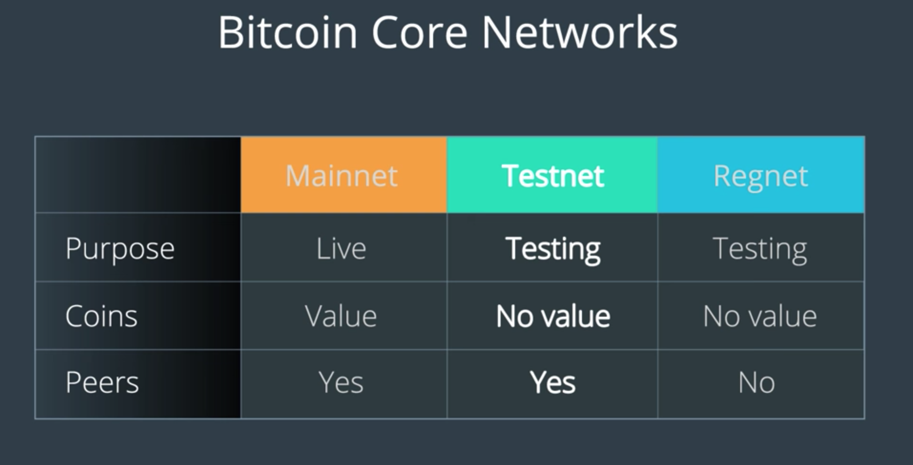
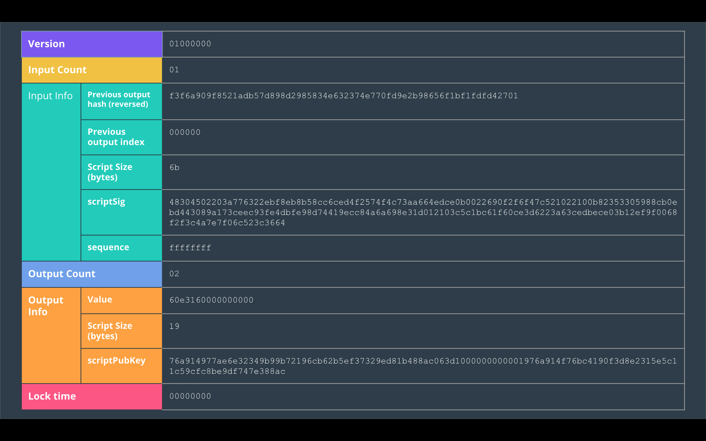

# Welcome to the blockchain revolution
## Welcome
### What Is The Blockchain?
The blockchain has been described as everything from digital gold to a replacement for the internet.

This field is developing incredibly fast, and there are so many opportunities for you to get involved with.

The blockchain has the potential to revolutionize industries like finance, government, and medicine. It's even re-imagining the way we think about personal identity and security.

### What Is In The Program?
Throughout this program, we'll explore all aspects of blockchain technologies. Our goal is to help you learn the important skills you’ll need to become a blockchain developer.

We'll discuss important topics like identity, data storage, web services, and smart contracts.

You’ll learn to apply these skills in the real world, whether for a new career, to contribute to a project, or to build your very own, world changing application.

### Influence of Blockchain
- Personal Identification
- Medicine
- Finance
- Supply chain management
- Governance

### Overview
Shared database that contains a list of transactions (record of information)

**Hash**: A unique fingerprint of information

# Blockchain basics
## Introduction

## Financial Transactions
Bank is the trusted 3rd party, emtity that facilitates interactions between 2 parties

**Ledger**: A list of transaction records

**Double Spending**: When someone spends the same money more than once

What are potential flaws with this system?
- Potential Answer 1: No easy way to see if transactions have been tampered with
- Potential Answer 2: Transaction time is dependent on the banks to validate the transactions

## Introduction to Bitcoin
The concepts and ideas bitcoin developed continue to influence all other blockchains. For that reason, we'll use bitcoin as a way to help walk through some important concepts in the program.

Bitcoin: A digital currency that utilizrs the blockchain to facilitate financial transactions

A block is a group of transactions bundled together

Bitcoin is not THE blockchain, it is A blockchain.

## Hashing 
It's a way to create a digital fingerprint for a piece of data. It's a fundamental idea behind what makes the blockchain work. 

*A digital fingerprint for information*

**Hashing Function**: Maps a group of data to a unique hash value

SHA256 used in bitcoin

## Blocks
Blocks are the fundamental components of the blockchain.

*A container that holds a list of transactions to be added to the blockchain*

**Blockchain**: Shared digital ledger that records a list of transactions

Time entry is the blockchains solution to the double spending problem

Merkle root: Hash that represents every transaction inside the block

*Nonce is an arbirtrary number that can only be used once*. Nonce is related to mining. Block Data + Nonce = Hash value

**Block diffeculty**: The number of zeros required to solve the problem of finding the hash value. 00000HASHVALUE

Block size is the space of a block. Decided by the developer and will be the same for all blocks. 

## Blockchain
The blockchain is specifically the place where data is stored. Everything other component is the system around the blockchain that helps make it all work.

*Digital ledger that contains the entire history of transactions made on the network*. Accumulations of linked blocks joined together by hash values tht have been created over time. All information is permanent and cannot be changed. Immutable data. Two main things are needed, blocks and hash values

Qualities of connecting by hash values
- Changed blocks are invalidated, entire chain breaks

First block is the genesis block

## Distributed Peer-to-Peer Networks

- **Peer-to-Peer Network**: A network of computers that allows information to be shared across users.
- **Distributed Network**: A network that allows information to spread out across many users.

The way information is shared across the distributed peer-to-peer network results in some pretty interesting things. One of these relates to how the transactions are handled and brought into the network in the first place.

Before becoming a part of the network, and eventually the blockchain, transactions are held in something known as a memory pool. 

## Memory Pool
The memory pool (also known as the mempool) is the waiting place for transactions before they enter the blockchain. The blockchain can only handle so much information at once, and the backlog of information goes here.

Reasons a Transaction would leave the Mempoo
- The transaction expired by timeout (by default 14 days after entering)
- The transaction was at the bottom of the mempool (when sorted by fee per size), the memool had reached its size limit, and a new higher fee transaction was accepted, evicting the transaction at the bottom
- The transaction was included in a block
- The transaction or one of its unconfirmed ancestors conflicts with a transaction that was included in a block

The questions I have at this point are...
- Who's making the decisions around here?
- Who is deciding when a transaction is valid or what data belongs in a block?

This is done using what's known as consensus. Consensus drives all of the decisions made to establish and grow the blockchain.

## Consensus
Consensus is how the blockchain makes decisions. Basically **consensus** is an idea, but the idea is implemented through many different algorithms. These algorithms are all different ways to try and achieve consensus more effectively. Things like **proof of work**, **proof of stake**, and **DBFT* are all consensus algorithms.

_Consensus is how the network reaches agreement about which transactions are most trustworthy_

### Byzantine General's Problem
The Byzantine General's problem solves many core issues around how members of a network can trust one another.
What it doesn't do is provide the specific system you would use to go about implementing this solution.
These implementations are done using consensus algorithms.

### Proof of work
One of the first algorithms created for consensus is known as proof of work. The idea behind proof of work is that whoever puts in the most work to contribute to the system is the most trustworthy.

_Proof of work: System where information can be costly to produce, but easy to verify_

In bitcoins difficulty is adjusted so that a block is generated every ten minutes. 

Issues with PoW
- Extremely high energy consumptions
- A monopoly of miners leads to concern for centralization

Other algorithms have been built to try and handle these problems more effectively. One of them, known as proof of stake, has it's own interesting take on how to handle consensus. 

### Proof of Stake
Proof of stake is another successful algorithm used to help achieve consensus on a blockchain. The key idea behind proof of stake is that it focuses on giving votes to members depending on how much stake they have in the success of the chain.

_Seeks to achieve concensus by giving votes to those with stake in the system_

PoS
- How does it work?
  - No miners, just validators
  - They put a stake on the block, if it is false they lose it
  - The more their coins the more probable they are chosen to validate next block
- Potential challenges
  - Nothing at stake problem
- Who is using it
  - Ethereum: Casper project
  - Dash: Built on the core bitcoing platform and added features for privacy and Tx speed
  - Lisk: Focused on creating Decentralized apps, Uses delegeted proof of stake
  
This is a popular algorithm used to achieve consensus, but there are still others. Like we mentioned, there's a few more consensus models, one of which is known as Delegated Byzantine Fault Tolerance.

## Delegated Byzantine Fault Tolerance
Delegated Byzantine Fault Tolerance or DBFT for short, is yet another important consensus algorithm. Unlike proof of work or proof of stake, DBFT tries to achieve consensus by assigning roles to nodes to help coordinate consensus.

_Consenus algorithm based on assigning roles to nodes to help coordinate consensus_

- How does it work?
  - No miners, nodes  split between ordinary and consensus nodes
  - Consensus nodes act as representatives to other nodes of the network
  - Speaker and delegates for new blocks
  - Much faster and less resources than PoW
- Potential challenges
  - Dishonest speaker scenario
  - Dishonest delegate scenario
- Who is using it
  - NEO
  
  
## Other Consensus Algorithms
Proof of work, Proof of Stake, Delegated Byzantine Fault Tolerance...so many new terms.

Guess what...there's more!

A big part of being a successful blockchain developer is taking initiative on staying up to date with the most current tools and ideas.

This section doesn't go in depth about any algorithm in particular. What we're hoping you'll do instead is consider the question below, then take some time to go through some of the resources we provide.

Do you like any of these ideas in particular? Let us know what you would do in the situation below.

## Recap of Achieving Consensus
### Byzantine Generals’ Problem
As we saw in the Byzantines’ General Problem, this challenge has been around for a while - achieving consensus in a distributed system with suboptimal communication between participants who do not necessarily trust each other isn’t new.

### Proof of Work (PoW)
Bitcoin figured out how to use the Proof of Work algorithm to solve this issue.

The main innovation that Satoshi Nakamoto introduced in Bitcoin’s white paper is using proof of work (POW) to achieve consensus without a central authority and solve the double-spend problem.

**How Does It Work?**

PoW involves miner nodes, or miners, to solve a math puzzle that requires a lot of computation power. Whichever miner is able to solve the puzzle the fastest is able to add a block of transactions to the blockchain, and in return, they are paid the transaction fees from all the transactions included in the block as well as paid by the network with bitcoins that were newly created upon the “mining” of the block.

**Potential Issues**
2 Commonly discussed issues with Proof of Work are:
- Extremely High-Energy Consumption
- A Monopoloy of Miners which Leads to a Concern for System Centralizations

### Proof of Stake
In the Proof-of-Stake Consensus Protocol, there are no more miners; instead, there are Validators. These validators, or stakeholders, determine which block makes it onto the blockchain. In order to validate transactions and create blocks, validators puts their own coins as “stake”. Think of it as they are placing a bet - if they validate a fraudulent transaction, they lose their holdings as well as their rights to participate as a validator in the future. In theory, this check incentivizes the system to validate only truthful transactions.

**Potential Issues**
We discussed the “Nothing At Stake” problem in which a bad acting Validator places pets on multiple forks so they theoretically always win out in the end.

**Proposed Solutions**
Slasher Strategy which entails penalizing validators if they simultaneously create blocks on multiple chains.

Additionally there’s the **Punisher** Strategy which simply punishes validators for creating blocks on the wrong chain. In this method, Validators will be motivated to be selective and conscious about which blockchain they put their stake in.

**Who’s Using It?**
Ethereum, DASH, and LISK are big proponents

### Delegated Byzantine Fault Tolerance (dBFT)
dBFT uses a system similar to a democracy where Ordinary Nodes the system vote on representative Delegate Nodes to decide which blocks should be added to the blockchain. When it’s time to add a block, a Speaker is randomly assigned from the group of Delegates to create a new block and propose the new block. 66.66% of delegates need to approve on the block for it to pass.

**Potential Issues**
Two issues we explored were the case of the Dishonest Speaker and the Dishonest Delegate.

**Dishonest Speaker**
There is always a chance the Speaker, who is randomly selected from the Delegates, could be dishonest or malfunctions. In this situation, the network needs to rely on honest delegates to vote the proposed block down so it doesn’t reach 66% approval. It is up to users of protocol who vote on Delegates, to find out which delegate are not trustworthy and vote on other delegates that are truthful.

**Dishonest Delegate**
In this case, the chosen Speaker is honest but there are Dishonest Delegates in the system meaning even if they receive a proposal for new block that is faulty, they can say it is valid. If it is a minority of delegates that are dishonest, the block will not make it and new speaker is elected

**Who’s Using It?**
NEO is a big advocator of this protocol.

### In Conclusion
While, Proof of Work and Proof of Stake are definitely the more popular choices, there are newer mechanisms coming up and proving themselves.

Remember that a consensus algorithm gets its reputation from being safe for a long period of time

There is no “perfect” consensus mechanism, and chances are that there never will be, but it is interesting to see newer cryptocurrencies coming out with their own protocols and understand their pros and cons.

$$\pagebreak$$

# Blockchain transactions
## Overview
Blockchains are a transaction-based system, so the topic of Transactions is important!

In this lesson, you’ll pull together the individual concepts we introduced earlier - keys, blocks, wallets, etc - and understand how they interact together to form a secure transaction.

By the end of this lesson you will:

- Understand the mechanics of a simple transaction between 2 entities (e.g. Joe and Jessica) using private keys, public keys, wallets, and public blockchain.
- Determine and generate the appropriate wallet type for the needs of a given situation. (Non-deterministic, Sequential Deterministic, and Hierarchical Deterministic)
- Create and restore a bitcoin wallet using private keys.
-  Recognize signing transactions as a part of the transaction lifecycle and can describe its purpose and process.

## Blockchain Identity
Like a social security number, a bank account, a drivers license, or a club membership, your blockchain identity is how you establish yourself in the world, in this case the blockchain world.

**Wallet Address**: unique identifier for your wallet. Someone cannot use this address to trace us back

**Private (secret) key**: A secret number that allows you to spend bitcoin from your wallet. It must not be shared with anyone 

**Public key**: Publicly shareable key that cannot be used to spend bitcoin. Public keys are used to receive bitcoins

Private key can track public key. Opposite is not possible. Bitcoin is using Elipctic Curve Digital Signature Algorithm (ECDSA) 

### Blockchain Hashing Algorithms
With a better understanding of the goals and purpose of wallet addresses, private keys, and public keys, we can now look further into how each of these are created.

By using hashing algorithms, blockchains help create our identity in a way that is extremely secure.

A wallet address makes sure that our transactions cannot be traced. It is created from public key. Bitcoin uses SHA256 and RIPEMD-160

## Wallet Overview
Blockchain identities are made up of a few important tools like wallets, addresses, and keys. Not only are there a few of these different tools creating our identity, it's also possible to implement them in different ways.

The ways these are implemented result in different wallet types. In this section, we'll go over the basics of wallets, and cover different wallet types to help you determine which is right for you.

### Key Terms
**Non-deterministic Wallet**: (random wallets) A wallet where private keys are generated from random numbers.

**Deterministic Wallet**: A wallet where addresses, private keys, and public keys can be traced back to their original seed words.

**Hierarchical Deterministic Wallet**: An advanced type of deterministic wallet that contains keys derived in a tree structure.

## Wallet Types
### Non-Deterministic Wallets
First introduced in Bitcoin
$$Random\space Number \rightarrow Private \space Key \rightarrow Public \space Key \rightarrow Wallet \space Address$$

Every time a new key is generated you need to back up the wallet. Used in situations where wallets might be generated for backend services using private keys not derived from a seed.  

### Deterministic Wallets
**Sequential Deterministic Wallet**

First introduced in Electrum

Seed id dufficient to recover all private keys. A single backup is sufficient. 

**Hierarchical Deterministic Wallet**
Parent and child keys

### Scenarios
I want to create paper wallets derived from one master key so I can store and recover all of them deterministically. Which wallet is used to achieve this? - Sequential Deterministic

I’m creating a web server that sells widgets and want to generate an unique transaction address for every customer and every address and track it independently. I want to be able to take a master public key and generate a sequence of sub-public keys, each associated with a transaction and put it on a public web server and make sure the web server has no private keys. -Hierarchical Deterministic 

A shoe supply chain is being audited. The auditors are given a public key so they can see all the transactions of the sub tree but they can’t unlock it. Which wallet is used to achieve this?  -Hierarchical Deterministic 

A blockchain social media website uses private keys to secure personal user data. It uses wallets for backend services that use private keys that are not derived from a seed. Which wallet is used to achieve this? - Non-Deterministic

## Private keys
Wallets are great, but it's what's inside that counts. Inside wallets you'll find keys!

**Private Key**: A 256-bit random number between $1$ and $2^{256}$.

**Entropy**: Lack of order or predictability. The degree of disorder or randomness in the system.

What is the purpose of the private key?
- Private keys generate Public Keys and Wallet Addresses
- Private Keys allow us to interact with the blockchain
- Private Keys need to be Cryptographically secure
### How to Generate a Private Key
- Flip coin
- Libraries with cryptographic secure number generator
- bitcoin address generating websites
- Software wallets

## Get Your Own Wallet
Done in Electrum

## Restoring Blockchain Identity
### Ways to Restore a Wallet
If you ever need to restore your wallet, there are 2 ways to do it. You can do it with the wallet words you saved, or with the private keys from when you first created your wallet.

**Use a Seed**

One way to restore a wallet is using a seed. The ‘seed’ is the 12 words you were given when creating your wallet. If you can remember these words, you can use them to restore your wallet!

The benefit of restoring your identity using the seed is that it can be much simpler than using the private key. It's easier to remember a list of words than a random string of numbers and letters.

The hardest part to any of this is safely storing or remembering this information for when you need it. Anybody else who discovers the list of words can access the wallet and any funds tied to it.

So be VERY careful!

**Use a Private Key**

Another way to restore a wallet is with a private key.

When restoring a wallet using a private key, there are 2 ways to do it. You can either import or sweep this key, and it’s useful to understand the difference.

**_Import a Private Key_**

When importing a private key, you'll have a source wallet and a destination wallet. The destination wallet is likely filled with a group of private keys already. To import the key you move the private key from the source wallet to the destination wallet.

This results in you getting access to both the source wallet AND the destination wallet.

The downside to importing is that the private key from the source wallet is essentially compromised since it was shared. If someone gets access to the private key from the source wallet, they can access those bitcoins.

**_Sweep a Private Key_**

When you sweep a private key, you add a private key from a source wallet into the destination wallet. All the bitcoins that belong to that private key are swept from the source wallet over into the destination wallet.

This is a little different than importing because it completely removes the funds from the original wallet. You’ll now only be using this new wallet to make future transactions.

### Which should you choose?
Why would you import or sweep a private key?

Sweep a wallet if you're worried about wallet security.This might happen in the case that you think someone might have access to your private key. Sweeping completely cleans out the wallet so that no one will have access to your bitcoins.

If you are certain no one has gotten access to your private key, and that no one ever will, then you can import the key instead. This is useful in cases where you need the funds to be available from multiple wallets.

When in doubt, stick with sweeping. It’s more secure this way, and it avoids some problems that are associated with importing a wallet.

## Sign a Transaction
After creating a transaction there's a few things to consider.

- How do we know it's valid?
- Who owns the transaction?

We validate transactions and assign ownership using what's known as a digital signature. These signatures are an important piece underlying the security of the blockchain. In this video, we'll explore this idea further to discuss how signing a transaction works.

**Signature**: Establishes proof of ownership for each transaction on the blockchain

**Wallet Address** is similar to bank account, unique address that belongs to you. Links to private key

Unspent transaction outout known as **UTXO**

To create a transaction output you need to have the sum of the input transactions which are equal to or greater than the value you are sending.

### Recap
- Prove address ownership by signing with private key
- Transaction life cycle from sender to receiver
- Unspent transaction outout known as UTXO

## Blockchain Transaction Lifecycle
**Transaction** $\rightarrow$ **Wallet** $\rightarrow$ **Sigmature** $\rightarrow$ **Mempool** $\rightarrow$ **Network** $\rightarrow$ **Consensus** $\rightarrow$ **Hashing** $\rightarrow$ **Block** $\rightarrow$ **Blockchain**

$$\pagebreak$$

# Blockchain Data Overview
## Overview
**Lesson Objective**: Be able to describe general concepts of a blockchain dataset.

### Concepts

- **Blockchain as a Dataset**: Differentiate the pros and cons of the blockchain as a dataset
- **Blockchain Use Cases**: Determine whether or not an application could benefit from using a blockchain.
- **Explore Bitcoin Data**: Explore bitcoin block data using the debug log console
- **P2P Network vs Client-Server Model**: Compare and contrast peer-to-peer network vs the client server model.
- **Mining the Blockchain Dataset**: Demonstrate how the mining process controls the state of the chain.
- **Explore the Code for Mining**: Explore bitcoin code that allows for mining Bitcoin Improvement Proposals: Describe the bitcoin improvement proposal process.
- **Softfork vs Hardfork**: Discuss the details of softforks and hardforks using examples.

## Blockchain as a Dataset
__**Database**: Collection of information organized to allow easier access and management__

Blockchain is a type of database

**Traditional Database**

- **Network**: centralized, remains with authoority,requires authentication
- **Functions**: CRUD
- **Mutability**: Mutable
- **Authorization**: centralized
- **Transparency**: Low

**Blockchain Characteristics**

- **Network**: (+)control given to nodes, (-) must achieve consensus
- **Functions**: REad, Append, Validate
  - (+) Accurate historical record
  - (+) Faster read and write
  - (-) Must achieve consensus
- **Mutability**: Immutable, data cannot be updated afyet being added to the database
  - (+) Permanent hstorical record
  - (-) Storage space
- **Authorization**: Distributed
  - (+) Extremely secure
  - (-) Cannot dispute transactions
- **Transparency**: Highly transparent
  - (+) Everyone has access
  - (-) No permission control
  
  
## Do you need a Blockchain?

- Do you need a database?
- Does it require shared write access?
- Will you need to create the trust between users?
- Can you operate without trusted 3rd parties?
- Can you operate without control over permissions?

If YES, blockchain is the answer

A blockchain is an wonderful option for electronic voting.
In the same way that blockchain acts as a public ledger for Bitcoin, it can also create a permanent and public ledger for votes.

## Blockchain Types

 - **Public**: Everyone has access
 - **Private**
 - **Hybrid**
 
 
 https://www.ibm.com/blogs/blockchain/2017/05/the-difference-between-public-and-private-blockchain/
 https://hackernoon.com/3-popular-types-of-blockchains-you-need-to-know-7a5b98ee545a
 
Question to help you determine which type of blockchain is right for your situation.

- Will transactions be public?
- Will other companies need access to your data?
- Should some information be public while other information is restricted?
 
 ## P2P Network vs Client-Server Model
 
 **Client-Server**: Application structure that break up tasks between service providers (servers) and service requesters (clients)

**P2P Network**: Network of computers that share access to files with each other

- **Infrastructure**: Single server (corporations) vs Collection of nodes (mining farms)
- **Control**: Authority vs Network
- **Cost**: Expensive vs cheap
- **Security**: High vs Low
- **Stability**: Stable vS Unstable

P2P network itself isn’t what’s contributing to the security of the blockchain. The blockchain is made secure using private keys, public keys, wallet address, and cryptography like we’ve seen before.

## Explore Blockchain Data

- Block header
- Block Transactions

Change is the value of the full input mines value sent minus the miners reward

**Block height**: Block number in the chain
 
Previous hash, nonce, bits, and time stamp help assist in block immutability in the chain. If one is modified after inclusion into the chain, the block hash would be invalid which would break the chain.

## Explore Bitcoin's Codebase
- Genesis Block
- Original timestamp
- Other variables

## BIPs and Forks

**Bitcoin Improvement Proposal**: Technical documents used to issue changes to the bitcoin core client

- Written by community members
- Voted on by miners
- Accepted or denied
- Implemented by developers

**Hardfork**: Large change to the bitcoin protocol

- **Bitcoin Cash**: Upgrade to the size of a block resulted in a hard fork

**Softfork**: Small change to the bitcoin protocol, not permanent split

- **Segregated Witness (seqwit**: Softfork of bitcoin to increase the block size limit

**Source Code Forks**: Copy of blochain code base with no resulting connection to the original blockchain

- **Litecoin**: Source code fork of bitcoin that resulted in an alternative currency.Litecoin could provide a similar service as Bitcoin, but would be was better tailored for smaller, less expensive transactions. 

# Bitcoin Core Testnet

- Introduce bitcoin core
- Networks
- Bitcoin Core Debug Console

## Bitcoin Core - Motivation
**Objective**: Differentiate between **bitcoin** and **bitcoin core** and understand how they are used by developers.

**Key Terms**

- **Bitcoin**: Network of bitcoin users creating and validating transactions
- **Bitcoin Core**: Implementation of bitcoin that encompasses all of the software behind bitcoin
  - Connect to the network
  - Validate the Blockchain
  - Send and receive bitcoins
- **Debug Console**: Tool that allows you to interact with data on the bitcoin blockchain

## Bitcoin Core - Networks

- **Bitcoin Mainnet**: Primary Network where live transactions take place
- **Bitcoin Testnet**: Alternative Bitcoin blockchain that provides a test environment for applications
- **Bitcoin Regnet**: Alternative test network for testing bitcoin applications

## Mainnet vs Testnet

-**Purpose**: Production vs Testing
- **Environment**: Public
- **Peers**: Wntire network vs Testers
- **Size**: 14GB vs 0GB
- **Block Creation**: 10 mins
- **Value**: Full value vs No value
- **Public keys prefix**: 1 vs m or n
- **Block Difficulty**: Full vs half of mainnet

## Testing vs Regression

-**Purpose**: Testing
- **Environment**: Public Vs Private
- **Peers**: Testers vs None
- **Size**: 200GB vs 14GB
- **Block Creation**: 10 mins vs instantly
- **Value**: Full value vs No value
- **Public keys prefix**: m or n
- **Block Difficulty**: Half of mainnet vs None

# Bitcoin debug console
This is where this program really starts to turn from conceptual ideas to the lower level nuts and bolts you’ll need to build an application.

## Blockchain commands

- _getblockchaininfo_: Returns various state information about blockchain processing
- _getblockcount_: Returns the number of blocks in the blockchain
- _verifychain_ : verifies blockchain database

## Hash commands

- _getblockhash_: Returns hash of a block at the block number provided
- _getnetworkhashps_: Returns an estimated network hashes per second based on a specified number of recent blocks.
- _getbestblockhash_: Returns the hash of the best block.

**Hash Value**: A digital fingerprint for information

**Best Block**: Most recent block that you’ve synced to with your local copy of the blockchain.

## Block commands

- _getblock_: Returns details of block information.
- _getblockheader_: Returns information about the block header.
- _generate_: Immediately mines the specified number of blocks to an address in the wallet.

**Block**: A container that holds a list of transactions to be added to the blockchain.

## Wallet Commands

- _getwalletinfo_: Returns an object containing various information about a wallet’s state. 
- _listwallets_: Returns a list of currently loaded wallets.

**Wallet**: Software that stores private keys that give access to a bitcoin balance.

## Mempool commands

- _getmempoolinfo_: Returns details on the active state of the transaction memory pool.
- _getrawmempool_: Returns all transaction details in the memory pool.
- _getmempoolentry_: Returns mempool data for a given transaction.

**Mempool**: Waiting place for all unconfirmed transactions before they are added to the blockchain.

## Transaction Commands

- _getchaintxstats_: Compute statistics about the total number and rate of transactions in the chain
- _getrawtransaction_: Returns raw transaction data
- _listtransactions_: Returns a list of transactions for a given account

**Transaction**: Record of any movement of funds that takes place on the network.

## Signature Commands

- _signrawtransaction_: Sign inputs for a raw transaction. 
- _signmessage_: Sign message with the private key of an address

**Signature**: Establishes proof of ownership for each transaction on the blockchain.

## Network commands

- _getnetworkinfo_: Returns information about the state of the peer-to-peer network.
- _getpeerinfo_: Returns data about each connection network node.
- _getconnectioncount_: Returns the number of connections to other nodes.

**Peer-to-peer network**: A network of computers that allows information to be shared across users.

## Mining commands

- _getmininginfo_: Returns an object that contains mining-related information. 
- _getblocktemplate_: Returns data needed to construct a block. 
- _prioritisetransaction_: Accepts the transaction into mined blocks at a higher or lower priority.

**Proof of Work**: Consensus algorithm that requires manual processing from the user.

# Blockchain Data
You will be able to...

- Recognize the data structure of blocks and transactions.
- Recognize the purpose of Bitcoin Script opcodes that are commonly used in the input and output parts of a transaction process.
- Explore the limitations and best practices of embedding data in blockchain transactions.

## Block Data Model Recap
### Block Header

- **Previous Block’s Hash** - The hash value for the block that comes directly before a given block in the chain. This is what links blocks in the blockchain together
- **Time** - The time the block was created is also held in the header
- **Merkle Root** - The merkle root is a hash that represents every transaction included inside the block. To get the merkle root, pairs of transactions within a block are repeatedly hashed together. Each pair results in a single hash. Then the hash of 2 pairs of transactions are again hashed together, over and over again until you are left with a single hash value. Given that final hash value, known as the merkle root, you can now reverse the hashing to reconstruct the entire set of transactions from the original block.
- **Nonce** - A nonce (stands for “number only used once") is a number used in bitcoin mining. The blockchain miners are solving for the nonce what when added to a hashed block, and those 2 values are rehashed, will solve the mining puzzle.

## Transactions - Inputs and Outputs

_Transactions_ encode the transfer of value between participants in the system. In more detail, a transaction is a data structure that encodes a transfer of value from a source of funds called an “input” to a destination called an “output”.

_Inputs_ in one transaction are just the _unspent outputs_ from another transaction. All _inputs_ reference back to an _output_. Unspent Outputs is sometimes short-handed to UTXO.

## Transaction Data Models
In blockchain transactions are stored in a double hashed form. 

Transation input contains unclocking script, transaction output locking. They are used to validate the transaction

## Bitcoin Scripts

Unlocking and locking scripts

- What are their purposes?
- How do they work?
- Where to find them?

**Script**: List of instructions recorded in each transaction that when executed determines if the transaction is valid and the bitcoins can be spent. 

**Script**: The name of Bitcoin's transaction scripting language

**Scripting language**: A simple, lightweight language designed to be limited on scope and executable on a range of hardware

**Scripts**

- Stack-based language
- Stores Numbers (Data constants)
- Uses Opcodes (Push, Pop, etc)
- Executeds from left to right

The unlocking script of an input, interacts with the locking script of an output from a previous transaction.

**Here is a breakdown of the Raw Transaction.**
You will see components we’ve discussed before - Version, Input Count, Input Info, Output Count, Output Info, and Locktime. And there are components that are new. If you are interested in a full breakdown of all these components, review the section below.

**Version** - All transactions include information about the Bitcoin Version number so we know which rules this transaction follows.

**Input Count** - Which is how many inputs were used for this transaction

**Data stored in Input information:**

- **Previous output hash** - All inputs reference back to an output (UTXO). This points back to the transaction containing the UTXO that will be spend in this input. The hash value of this UTXO is saved in a reverse ordered here.
- **Previous output index** - The transaction may have more than one UTXO which are referenced by their index number. The first index is 0.
- **Unlocking Script Size** - This is the size of the Unlocking Script in bytes.
- **Unlocking Script** - This is the hash of the Unlocking Script that fulfills the conditions of the UTXO Locking Script.
- **Sequence Number** - This s a deprecated feature of bitcoin Currently set to ffffffff by default.
Output Count - which tells us how many outputs were produced from this transaction.

**Data stored in Output Information:**

- **Amount** - The amount of Bitcoin outputted in Satoshis (the smallest bitcoin unit). 10^8 Satoshis = 1 Bitcoin.
- **Locking Script Size** - This is the size of the Locking Script in bytes.
- **Locking Script** - This is the hash of the Locking Script that specifies the conditions that must be met to spend this output.

**Locktime** - The locktime field indicates the earliest time or the earliest block a transaction can be added to the blockchain. If the locktime is non-zero and less than 500 million, it is interpreted as a block height and miners have to wait until that block height is reached before attempting to add it to a block. If the locktime is above 500 million, it is read as a unix timestamp which means the number of seconds since the date January 1st 1970. It is usually 0 which means confirm as soon as possible.

## Script Opcodes

https://en.bitcoin.it/wiki/Script

## Attributes of Script

- Turing completeness: Not turing complete
  - No loops or complex flow control
  - Completely deterministic
  - Provides simplicity and security

- Stateless verification
  - No state saved prior to or after the script executes
  - Script is self-contained
  - Provides predictability no matter where script is executed
  
## Create a Raw Transaction
### Step 1. View UTXO

_listunspent_

### Step 2. View Details about Specific UTXO

_gettxout "txid" n ( include_mempool )_

## Step 3. Create Raw Transaction

_createrawtransaction [{"txid":"id","vout":n},...] {"address":amount,"data":"hex",...} ( locktime ) ( replaceable )_

## Step 4. Decode Raw Transaction

_decoderawtransaction "hexstring"_

## Step 5. Sign Raw Transaction

_signrawtransaction "hexstring" ( [{"txid":"id","vout":n,"scriptPubKey":"hex","redeemScript":"hex"},...] ["privatekey1",...] sighashtype )_

## Step 6. Send Raw Transaction

_sendrawtransaction "hexstring" ( allowhighfees )_

## Step 7. Query the TxID

_gettransaction "txid" ( include_watchonly )_

## Steps and Commands Used In This Exercise

- **Step 1 - View all unspent confirmed UTXO in the wallet** _listunspent_ - Show all the unspent confirmed outputs in our wallet)
- **Step 2 - View Details about a Specific UTXO** _gettxout_ - Get the details of this unspent output above
- **Step 3 - Create a Raw Transaction** _createrawtransaction_ - Create a transaction
- **Step 4 - Decode the Raw Transaction (to double-check it went through correctly)** _decoderawtransaction_ - View raw hex string that encodes the transaction details we supplied
- **Step 5 - Sign the Raw Transaction** _signrawtransaction_ - Sign the transaction
- **Step 6 - Submit the Raw Transaction to the Network** _sendrawtransction_ - Takes the raw hex string produced by signrawtransaction and returns a transaction hash (txid) as it submits the transaction on the network.
- **Step 7 - Query the TxID of the Transaction we sent** _gettransaction_ - Query the TxID and view details. Similar to online block explorer

## Embedding Data in Transactions

**op_returns**

- Stores up to 40 bytes
- Recorded in blockchain
- Does not bloat UTXO memory pool

# Private Blockchains
## Public and Private Blockchains

- **Permissions**: Permissioned vs Permissioned
- **Scalability**: Mode difficult vs Simpler
- **Vulnerability**: Less vs More vulnerable
- **Compliance**: Mode difficult vs Simpler

## Public and Private Blockchain Interaction

Usage of op_return to store the hash

**Cross chain functionality**: Allows a series of protocols that work in harmony to deliver decentralized applications

**Polkadot**: Intermediary between blockchains. Uses a multi-chain approach with a blockchain called Relay. Then utilizes a second blockchain called parachain which gathers and processes transactions. 

## Building a Simple Private Blockchain Part 1